NGED: A **N**ode **G**raph **ED**itor
=====================================

This is the result of my attempt to make an easy to use, myself-friendly node graph editor.

Core components of this project are `ngdoc.h` (node graph document) and `nged.h` (node graph editor), and with this project comes with two demos, which in hope will give you some basic ideas of what they can do - if you are also looking for a node graph editor that is standalone, customizable, scriptable, efficient, beautiful, ergonomic and cross-platform.

* [visual s7](examples/ngs7/) is lisp visualized in form of node graph, it looks like this:
  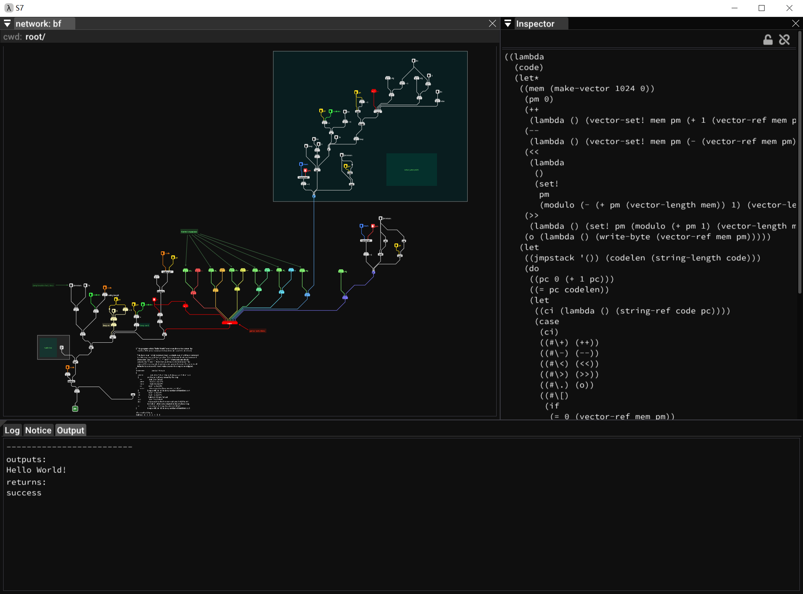

* [pydemo](examples/pydemo/) is a functional python scripting environment, it looks like this:
  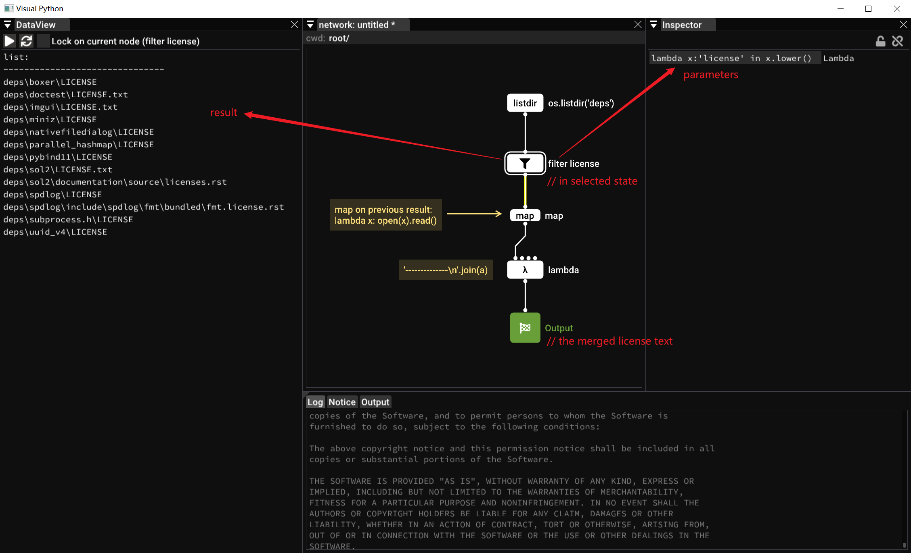

What they share in common is the beautiful UI and friendly operations.

## Features

### Cross platform

Tested on:

* Windows 10 x64
* Windows 11 x64
* Ubuntu 22 x64
* Debian 12 (WSL)
* Raspberry Pi OS Arm
* MacOS Sonoma (M3 Arm64)

### Nice looking link paths

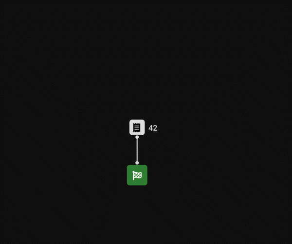

dense or sparse, it's easy to keep track on the relationship of nodes and links:

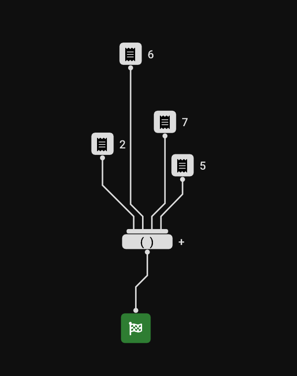

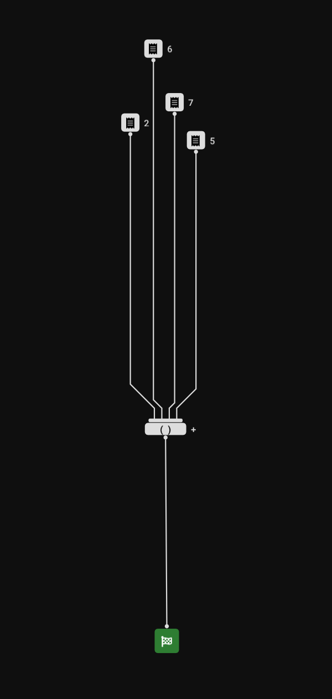

### Fuzzy search


### Routers

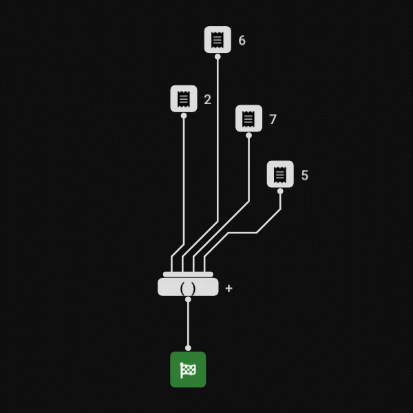

### Groups, Comments, Arrows and Tints

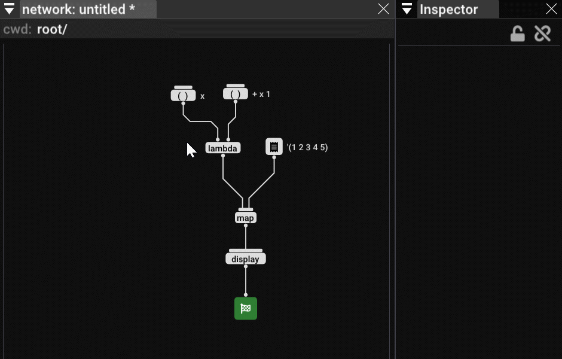

### Subgraphs

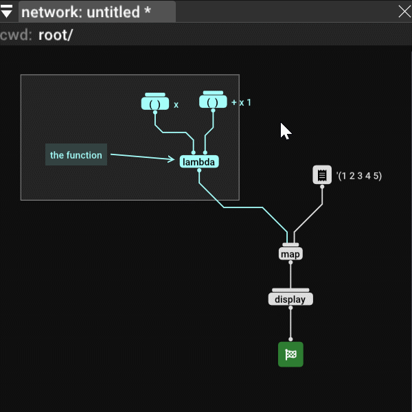

### Multiple views on one graph

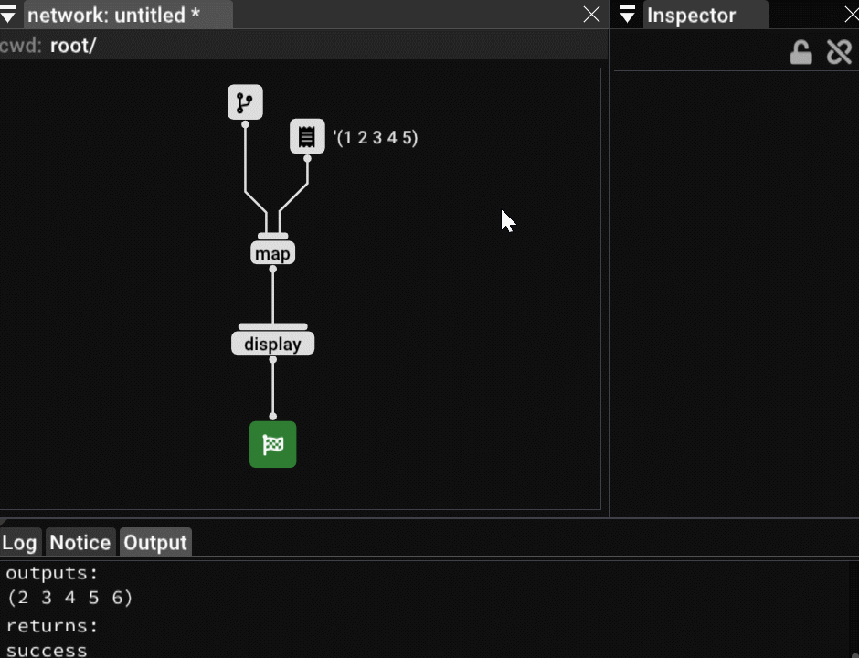

### Focus

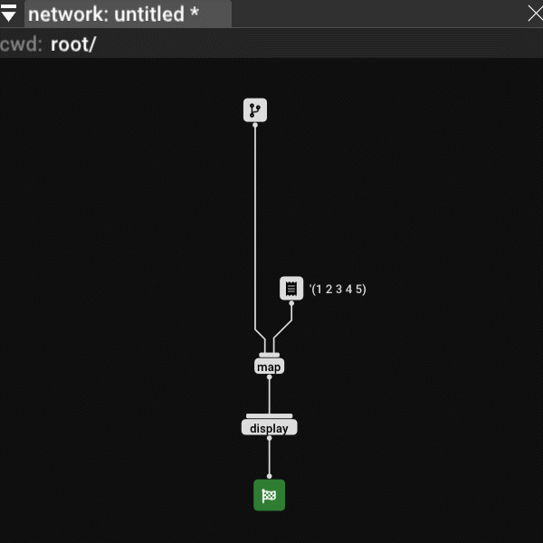

// press `F` to focus selection; or with nothing selected, press `F` to focus the entire graph

### Cut links with stroke

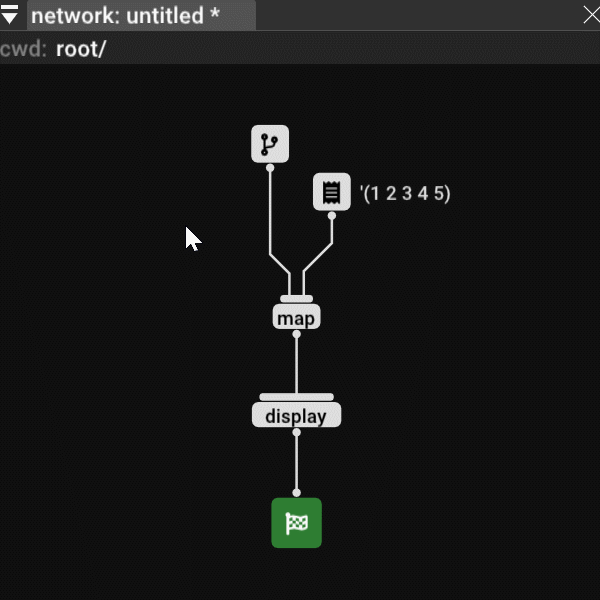

// press `Y` to cut links

### Drag links, Swap links

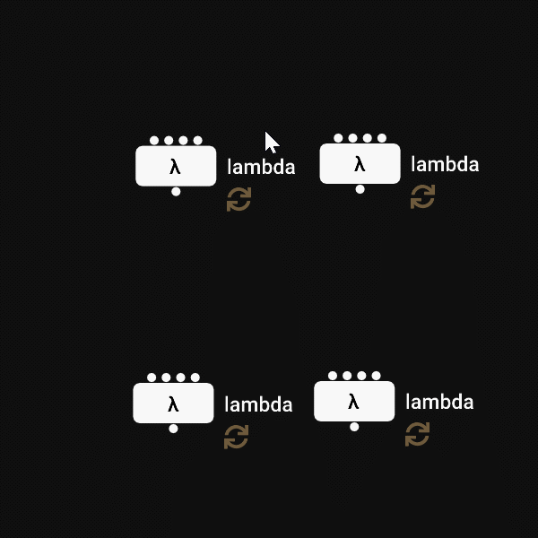

// drag link with `Shift` pressed, the link will be swaped if the drop target has existing link

### Find node

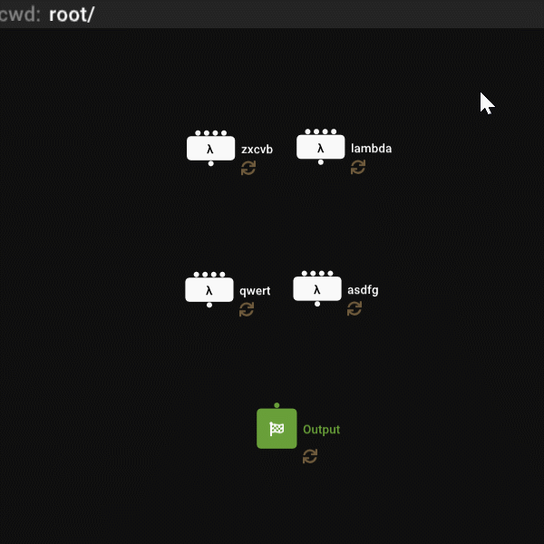

### Select, add to selection, remove from selection

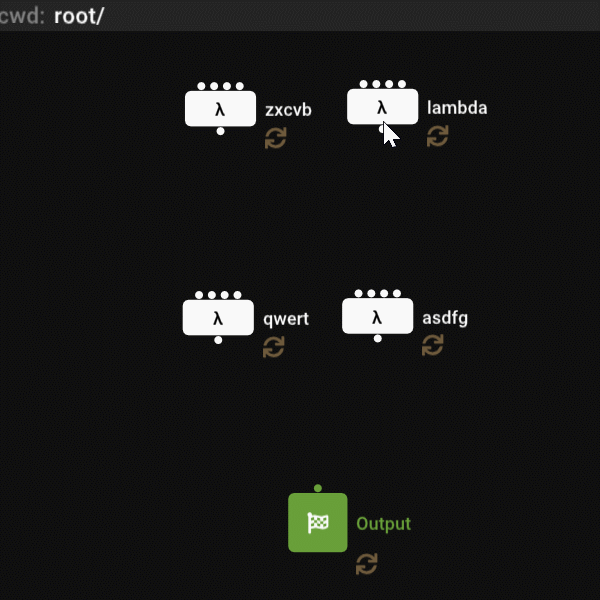

### Type checking

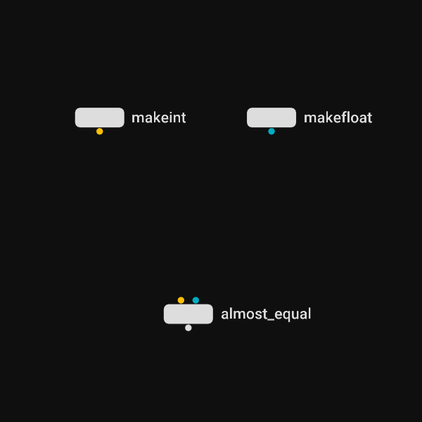

### Highlight node color / highlight pin color (type hinting)

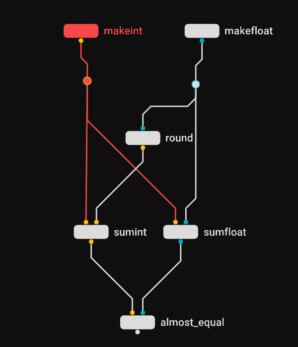


### Command palette

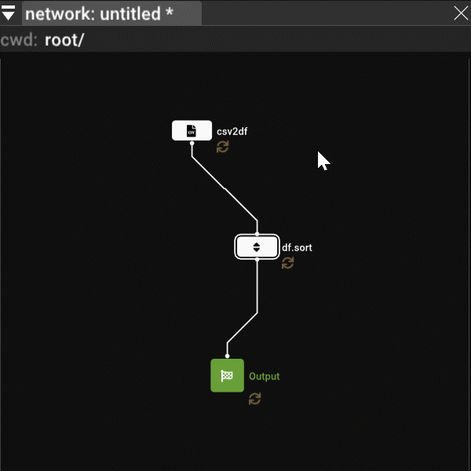

### Recursion (only for python demo)

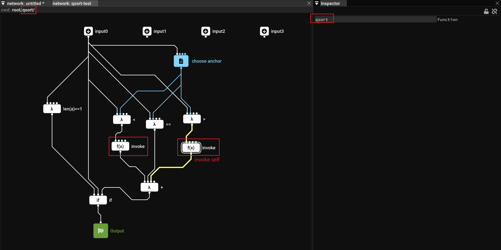

### Parmscript (only for python demo)

It's worth mention this other side project of mine: [parmscript](https://github.com/hugeproblem/parmscript)

With this, it's very easy to customize parameter interface on each node, and it can handle serialization / deserialization / evaluate to & from Python with no extra effort.

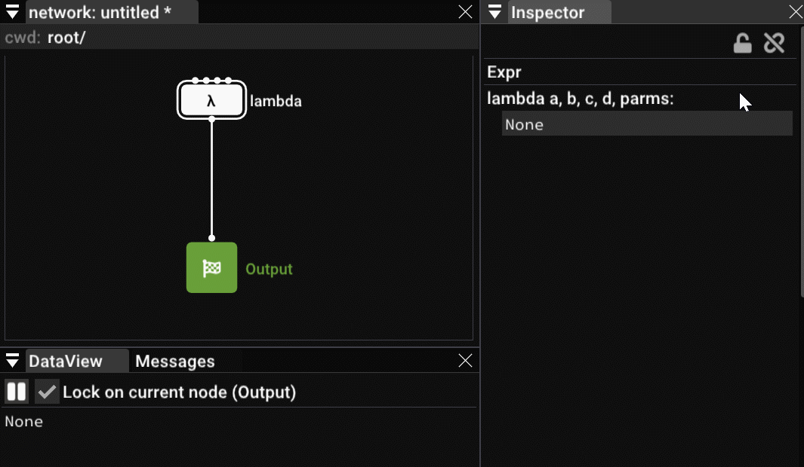

### Other

* Undo, Redo
* Copy, Paste
* Read-only view
* Headless (doc without UI and editor is fully functional)

### Limits

* One input pin can connect to at most _one_ output pin.
  And I think this is the correct way - if you do want to connect multiple links into one input,
  you should always declare the logic between those multiple inputs, like `or`, `and`, `merge` &etc. - and by adding another node, this can be done.

-----

## Building

### Requirements:

* [xmake](https://xmake.io/)
* A C++17 compatible compiler, tested on
  * MSVC 2017
  * MSVC 2019
  * Clang 14
  * Clang 15
  * GCC 11.4
* python & setuptools & pip, if you need the python binding and/or the pydemo

### To build:


```
> xmake
```

to build with python:

```
> python setup.py build
```

or

```
> python -m pip install .
```

### Options:

Graphic backend can be choosen between

* DirectX 11 (default for windows)
* DirectX 12
* OpenGL 3
* OpenGL 2 (default for non-windows)
* Vulkan

to config:

```
> xmake f --backend=(dx11|dx12|gl3|gl2|vulkan)
```

## Development

If you want to dive into the code, and/or make contribution,
it's strongly adviced to use `(neo|g)?vim` editor with `foldmethod=marker` and `foldmarker={{{,}}}` set,
otherwise the code look will likely to be not as tidy:

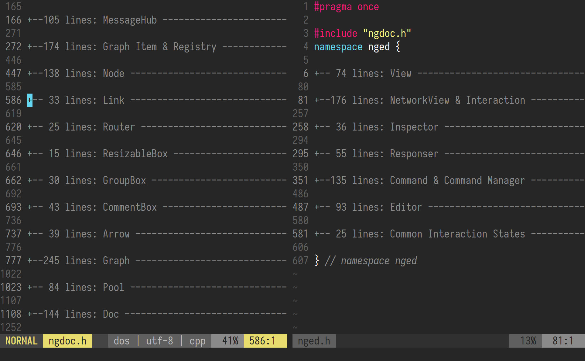

and please respect `.editorconfig` and `.clang-format`

_tips: `xmake project -k compile_commands` can generate `compile_commands.json` for C++ LSPs._


## To Make Your Own NodeGraph

Refer to [examples/demo/main.cpp](examples/demo/main.cpp) as the starting point.

Basically, define your own `NodeFactory`, and off you go.

