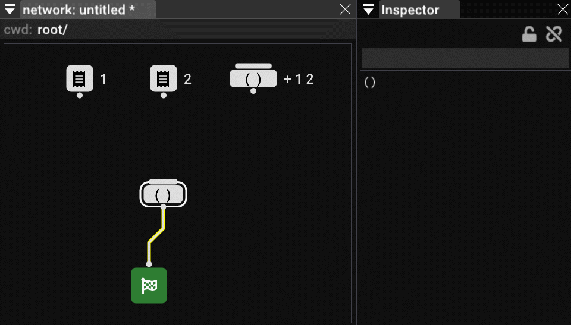

# Visual S7

This is my prove-of-concept lisp editor in node-graph form, and has [s7 scheme](https://ccrma.stanford.edu/software/snd/snd/s7.html) embeded.

But the editor is not limited to s7, it has only three primitives: `literal`, `()` operator and `quote`, the rules are:

* `literal` is raw code, which can be a symbol, literal value, or complex expressions.
* `()` takes arbitrary number of inputs, and put the inputs in between the parentheses,
  
  it optionally may have some parameters, which will be inserted right after the open parenthese, before any input value.
* `quote` is to add `quote`, `quasiquote`, `unquote`, `unquote splicing` decorations to the input

example:

With these rules, other scheme variants may be supported too, it's just an editor anyway.

